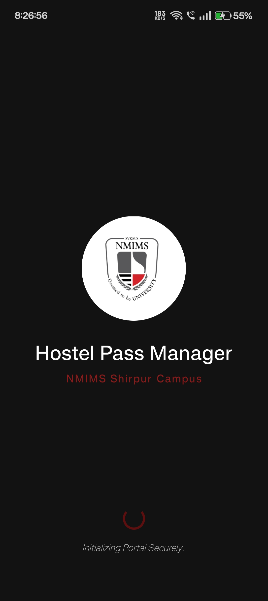
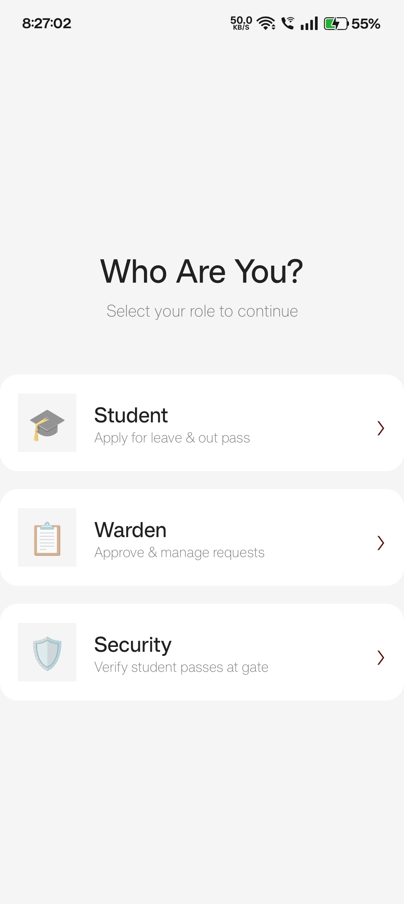
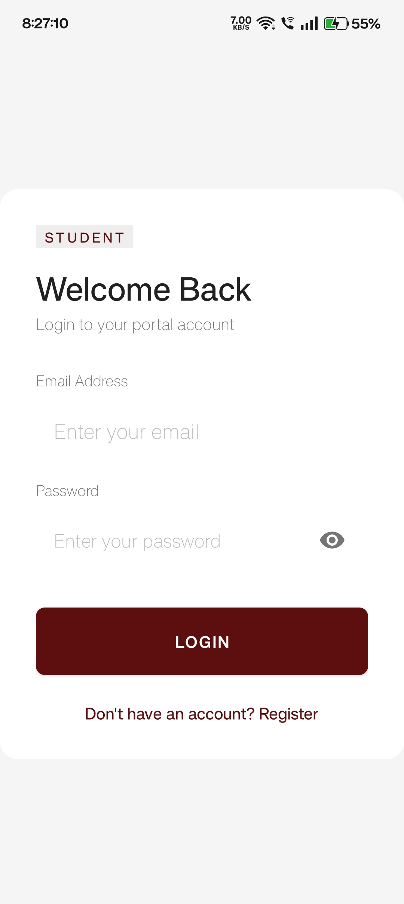
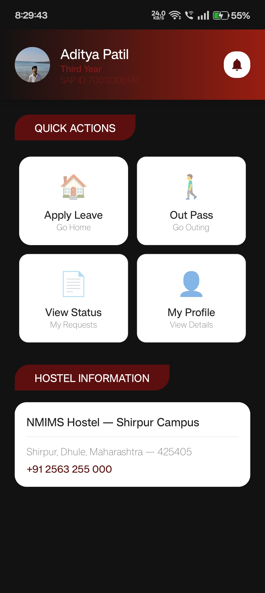
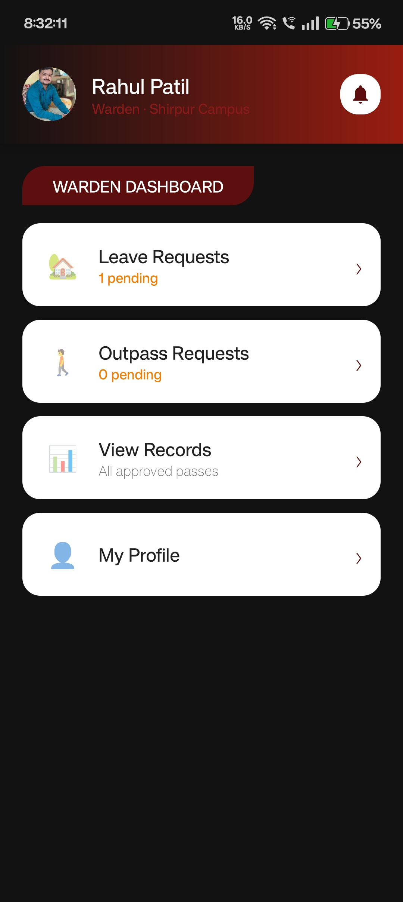
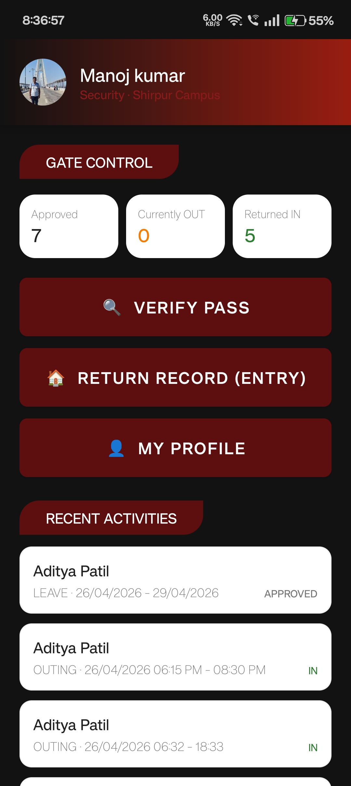
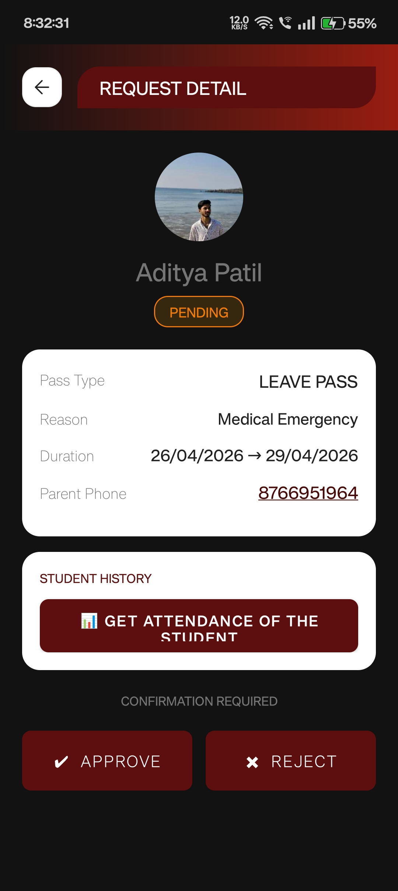
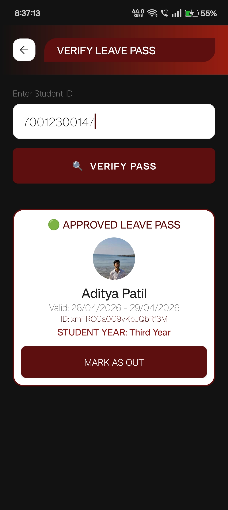
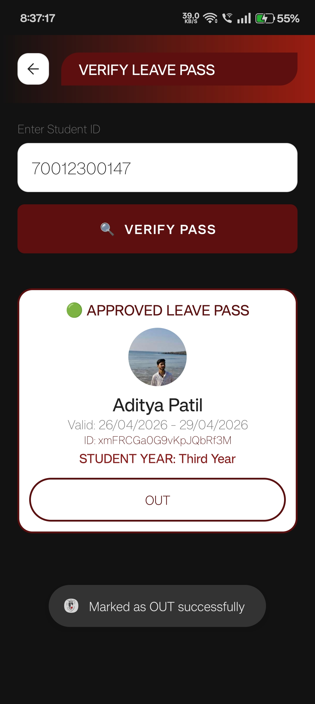
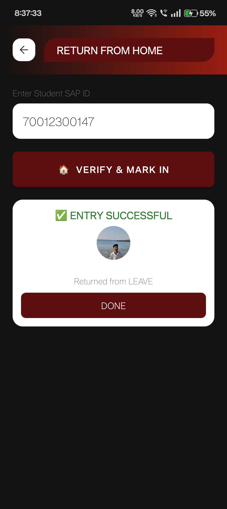

# Hostel Pass Management System

A simple, secure, and modern Android application to manage leave and outing passes for students, wardens, and security at NMIMS Shirpur. It replaces traditional paper systems with a fast, digital way to apply for, approve, and verify hostel gate passes.

---

## 📦 Download & Demo

- **[Download the Latest APK](https://github.com/Aditya-Patil-63/HostelPassManagement/releases/latest)**

---

## 🚀 Key Features

- **QR Code Verification**: Instant digital pass verification. Students present an auto-generated QR code; Security scans it to instantly log gate movements without manual data entry.
- **Real-Time Push Notifications**: Firebase Cloud Messaging (FCM) instantly alerts students when their passes are approved or rejected, and notifies wardens of overdue students.
- **Automated Workflow**: Students apply → Wardens verify (with parent dialer integration) and approve → Security scans the QR code at the gate.
- **Overdue Alerts**: Real-time monitoring of students who haven't returned to the hostel on time.
- **Dynamic Dashboards**: Dedicated UI and features customized specifically for Students, Wardens, and Security personnel.

---

## 🔒 Security & Architecture

### Robust Security Rules
- **Firestore Security Rules**: Strict role-based access control.
  - Students can only read/write their own passes and notifications.
  - Wardens can read all passes and update statuses (Approve/Reject).
  - Security can view passes and update gate timestamps (Mark OUT/IN).
- **Firebase Storage Rules**: Used for efficient profile photo management.
  - Users can only upload their own photos.
  - Uploads are strictly restricted to image files (`image/*`) with a maximum size of 5MB.

### Database Architecture (Firebase Firestore)
The application uses **Cloud Firestore** to manage real-time data across three main collections (`Users`, `Passes`, `Notifications`). Security tracks gate movements by updating the `outTime` and `inTime` fields instantly.

---

## 🛠️ Technical Stack

- **Frontend**: Java (Native Android), XML (Material Design & Custom Drawables)
- **Backend & Database**: Firebase Authentication, Cloud Firestore
- **Cloud Functions**: Node.js scripts for automated backend tasks
- **Push Notifications**: Firebase Cloud Messaging (FCM)
- **Media Storage**: Firebase Storage & Glide (for efficient image caching and loading)
- **QR Technology**: ZXing (for robust QR code generation & scanning)

---

## 🧪 Test Credentials

To evaluate the application, you can use the following test accounts:

| Role       | Email | Password |
|------------|-------|----------|
| **Student**  | student@test.com | password123 |
| **Warden**   | warden@test.com | password123 |
| **Security** | security@test.com | password123 |

*(Note: You can also register a new account from the app directly.)*

---

## 📸 Screenshots

### 👨‍🎓 Student & Authentication
| Splash Screen | Role Selection | Login Screen |
| :---: | :---: | :---: |
|  |  |  |

### 👮‍♂️ Dashboard Views
| Student Dashboard | Warden Dashboard | Security Dashboard |
| :---: | :---: | :---: |
|  |  |  |

### 🛡️ Warden & Security Verification
| Warden Verify | Security ID Entry |
| :---: | :---: |
|  |  |

### ✅ Security Movement Tracking
| Marked as OUT | Entry Successful |
| :---: | :---: |
|  |  |

---

## ⚙️ Installation & Setup
1. Clone the repository:
   ```bash
   git clone https://github.com/Aditya-Patil-63/HostelPassManagement.git
   ```
2. Open the project in **Android Studio**.
3. Create a project in the [Firebase Console](https://console.firebase.google.com/), register your Android app, and place your OWN `google-services.json` file into the `app/` directory. (Note: For security reasons, the original `google-services.json` is not included in this repository).
4. Build and Run the project.

---

**Developed for NMIMS Shirpur Campus**
